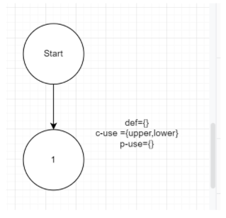

<!-- Output copied to clipboard! -->

<!-----

Yay, no errors, warnings, or alerts!

Conversion time: 1.186 seconds.

Using this Markdown file:

1. Paste this output into your source file.
2. See the notes and action items below regarding this conversion run.
3. Check the rendered output (headings, lists, code blocks, tables) for proper
   formatting and use a linkchecker before you publish this page.

Conversion notes:

* Docs to Markdown version 1.0β33
* Mon July 24 2022 22:25:53 GMT-0800 (PST)
* Source doc: SENG 637 Assignment 3 Report
* Tables are currently converted to HTML tables.
----->

**SENG 637 Assignment 3 Report	**

**Group: (3)**

<table>
  <tr>
   <td>
    Sr.
   </td>
   <td>
    Name
   </td>
  </tr>
  <tr>
   <td>
    1.
   </td>
   <td>
    Raiyan Kabir
   </td>
  </tr>
  <tr>
   <td>
    2.
   </td>
   <td>
    Jay Gurjar
   </td>
  </tr>
  <tr>
   <td>
    3.
   </td>
   <td>
    Rahul Jha
   </td>
     <tr>
        <td>
           4.
        </td>
      <td>
         Usman Zia
      </td
    </tr>
      <tr>
         <td>
            5.
         </td>
         <td>
            Tyler Shenassa
         </td>
      </tr>
  </tr>
</table>

**SENG 438 GROUP**

**Introduction**

This lab is used to familiarize students with generic code coverage methods. EclEmma was used as the code coverage tool which most of us had installed from Assignment 2. We decided to use the same approach as we did in Assignment 2. We decided that half of us would be on the Range and the other half on Data. Utilities. Most of our previous code had over 50% coverage and we added test cases to Range and Data Utilities to get the desired percentage. Each team later checked on each other to ensure the test cases were satisfactory and we also asked each other questions throughout the process. We learned that dividing group work into teams and checking on each other works really well for us and allows us to complete the assignments easily and quickly.  

**A detailed description of the testing strategy for the new unit test.**

The unit tests were developed based on the strategy we learned for white box testing. Test cases were developed based on the source code provided. EclEmma was initially used to get an initial glance at code coverage and then additional test cases were added for Branch Coverage and Statement Coverage. Line Coverage was already at over 90%. The code was then reviewed by the other team to make sure we didn't have any bugs. 

**Manual data-flow coverage calculations the two mentioned methods**

calculateColumnTotal:

def(1) = {data, total, rowCount, column}

use(1) = {}

def(2) = {r}

use(2) = {}

def(3) = {}

use(3) = {}

def(4) = {}

use(4) = {n, total}

def(5) = {}

use(5) = {n, r ,rowCount, column,}

def(6) = {}

use(6) = {total}

calculateColumnTotal:

DU(1, 1, data) = {[1]}

DU(1, 5, column) = {[1, 2, 3, 5], {1, 2, 4, 5}}

DU(1, 5, rowCount) = {[1, 2, 3, 5], [1, 2, 4, 5]}

DU(2, 4, n) = {[2], [4]}

DU(1, 6, total) = {[1, 2, 3, 5, 6] , [1, 2, 4, 5, 6]}

**calculateColumnTotalAllRows()**:DU(1, 1, data) = {[1]}, DU(1, 5, column) = {[1, 2, 3, 5], {1, 2, 4, 5}}, DU(1, 5, rowCount) = {[1, 2, 3, 5], [1, 2, 4, 5]}, DU(2, 4, n) = {[2], [4]}, DU(1, 6, total) = {[1, 2, 3, 5, 6] , [1, 2, 4, 5, 6]}

**calculateColumnTotalBlank()**: DU(1, 1, data) = {[1]}, DU(1, 5, column) = {[1, 2, 3, 5], {1, 2, 4, 5}}, DU(1, 5, rowCount) = {[1, 2, 3, 5], [1, 2, 4, 5]}, DU(2, 4, n) = {[2], [4]}, DU(1, 6, total) = {[1, 2, 3, 5, 6] , [1, 2, 4, 5, 6]}

**calculateColumnTotalInvalidIndex()**: DU(1, 1, data) = {[1]}, DU(1, 5, column) = {[1, 2, 3, 5], {1, 2, 4, 5}}, DU(1, 5, rowCount) = {[1, 2, 3, 5], [1, 2, 4, 5]}, DU(2, 4, n) = {[2], [4]}, DU(1, 6, total) = {[1, 2, 3, 5, 6] , [1, 2, 4, 5, 6]}

**calculateColumnTotalposBoundary()**: DU(1, 1, data) = {[1]}, DU(1, 5, column) = {[1, 2, 3, 5], {1, 2, 4, 5}}, DU(1, 5, rowCount) = {[1, 2, 3, 5], [1, 2, 4, 5]}, DU(2, 4, n) = {[2], [4]}, DU(1, 6, total) = {[1, 2, 3, 5, 6] , [1, 2, 4, 5, 6]}

**calculateColumnTotalnegBoundary()**: DU(1, 1, data) = {[1]}, DU(1, 5, column) = {[1, 2, 3, 5], {1, 2, 4, 5}}, DU(1, 5, rowCount) = {[1, 2, 3, 5], [1, 2, 4, 5]}, DU(2, 4, n) = {[2], [4]}, DU(1, 6, total) = {[1, 2, 3, 5, 6] , [1, 2, 4, 5, 6]}

isNaNRange:

def(1) = {}

use(1) = {lower,upper} 

DU(1, 1, upper) = {[1]}

DU(1, 1, lower) = {[1]}

**isNaNRangeShouldBeTrue(): **DU(1,1, upper) = {[1]}, DU(1,1, lower) = {[1]}

**isNaNRangeShouldBeFalse(): **DU(1,1, upper) = {[1]}, DU(1,1, lower) = {[1]}

**isNaNRangeShouldBeNotInNaNRange(): **DU(1,1, upper) = {[1]}, DU(1,1, lower) = {[1]}

**DU Pair Coverage **

calculateColumnTotal: coverage = 4/6 * 100% = 66.7%

isNANRange: coverage = 1/1 * 100% = 100%

**A high-level description of five selected test cases you have designed using coverage information, and how they have increased code coverage**

**For range:**

For the **combineShouldBeEqualTor1 ()** we increase our statement coverage by testing the different functions in the range such as .combine(), .getUpperBound() to increase our coverage. We tested combining different ranges and testing with their upper bounds as well.

For the **equalsTest()** we increased our statement branch coverage since the if(test.equals(“hello”)) local = true

Else local = false 

Allows for the first if condition to be false and the else to which increased branch coverage.

For the **combiningIgnoringNan5()** method we increased branch coverage through the if and else statements:

if(r3== null) assertTrue(true);

Else assertTrue(false);

  

**DataUtilities:**

**getCumuPercentageAtHundredPercent(): **Increases the coverage by testing the for loop inside getCumulativePercentages. We have multiple indexes with values 1, 4 and 5 respectively. The end result is 1.0 which is 100% and we test the for loop to make sure each value is added incrementally.

**getCumuPercentageAtTwentyPercentWithNull():** Increases coverage by checking the null statement. Inside the getCumulativePercentages function in DataUtilities, (v != null) makes sure that the for loop is not running and we test that by adding a null in values.

**calculateRowTotalNullValidArray(): **Increased the coverage by testing the overloaded version of the method. We test for int[] as well as the branch (n != null).

**calculateColumnTotal(): **Increased the coverage by testing the overloaded version of the method. We test for int[] as well as the branch  Number n = data.getValue(row, column), which is the value inside the array.

**Detailed report of coverage achieved of each class and method. **

* **All screenshots are found in the screenshots folder.**
   All screenshots can be found [here](/ScreenShots)

**Pros and Cons of coverage tools used and Metrics reported**

EclEmma was used with Eclipse IDE as code coverage tool. 

**Pros: **

* The tool could be installed from Eclipse, therefore eliminating any 3rd party requirements. 
* A vast variety of coverages metrics is included for ease. 
* Color coding illustrates if a method has been partially or fully tested.
* Metrics included for branches tested or missed which was very useful to increase code coverage. 

**Cons: **

* There is no information on which particular branch was missed, only a specific number stating which branches were covered. This made debugging complicated. 

**A comparison of advantages and disadvantages of requirements-based test generation and coverage-based test generation.**

**Advantages of requirements-based test generation: **

* Promotes a more creative approach to testing methods. 
* The simplicity of test creation is based on requirement boundaries.

**Disadvantages of requirements-based test generation: **

* Lack of confirmation in regards to what extent the code needs to be tested/covered.

**Advantages of coverage-based test generation: **

* Extensive testing and more targeted unit test

**Disadvantages of coverage-based test generation:**

* Requires in-depth knowledge and understanding of the source code. 
* Requires a lot of time and resource commitment to achieve full coverage.

**Teamwork/effort division:**

We decided that three of us would be on the Range and the other two on Data Utilities. Each team completed the code coverage for each section. We then added test cases to get the desired coverage. Each team later checked on each other to ensure the test cases were satisfactory and we also asked each other questions throughout the process. 

**Difficulties Encountered**

Developing unit tests to get high code coverage. 

**Lessons Learned**

We learned how to use EclEmma and create units tests that maximize coverage.

~~ ~~

**Comments and Feedback**

In the lab, we got the chance to learn more about different methods of code coverage test cases and how it's important to have good test coverage especially. All in all, an interesting lab to do. 
